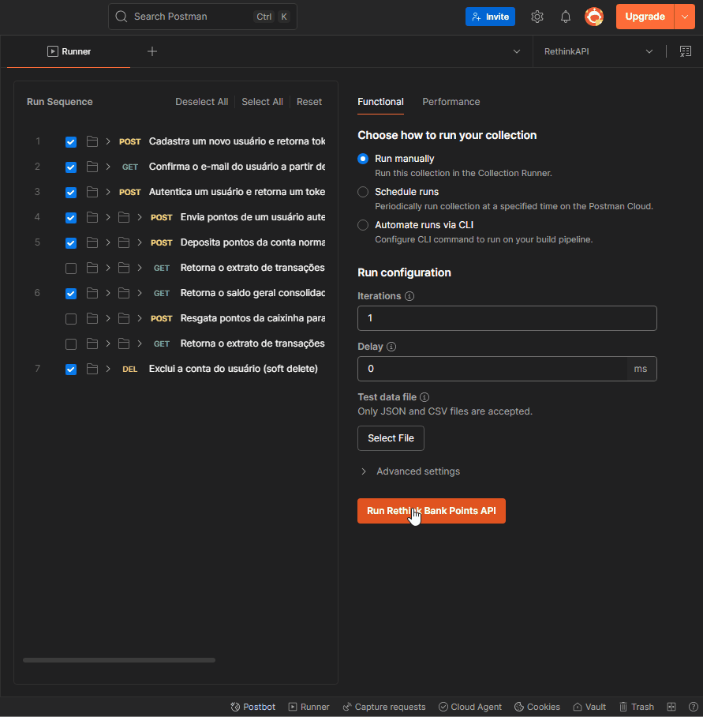
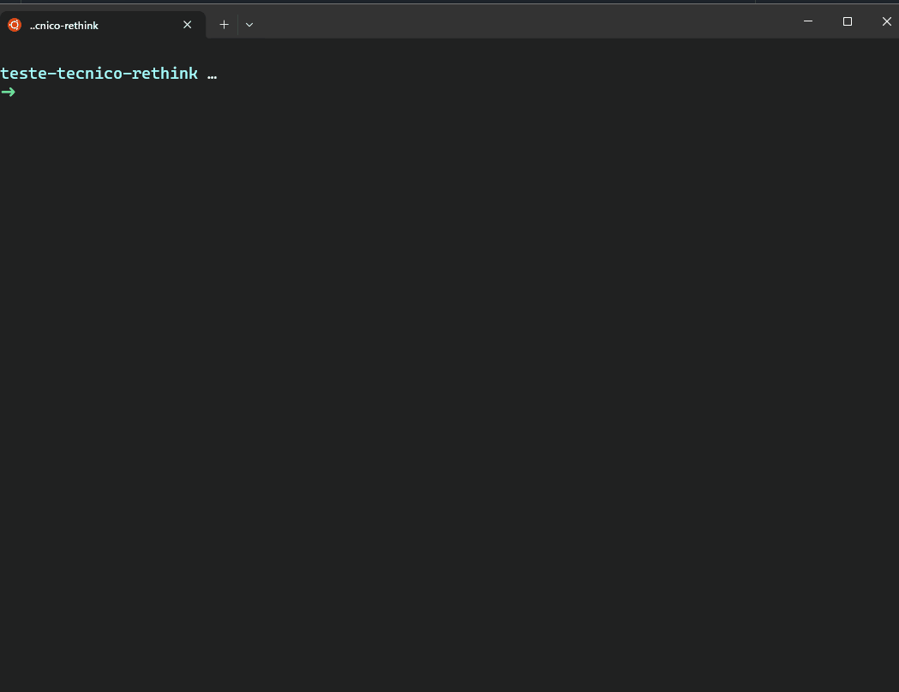
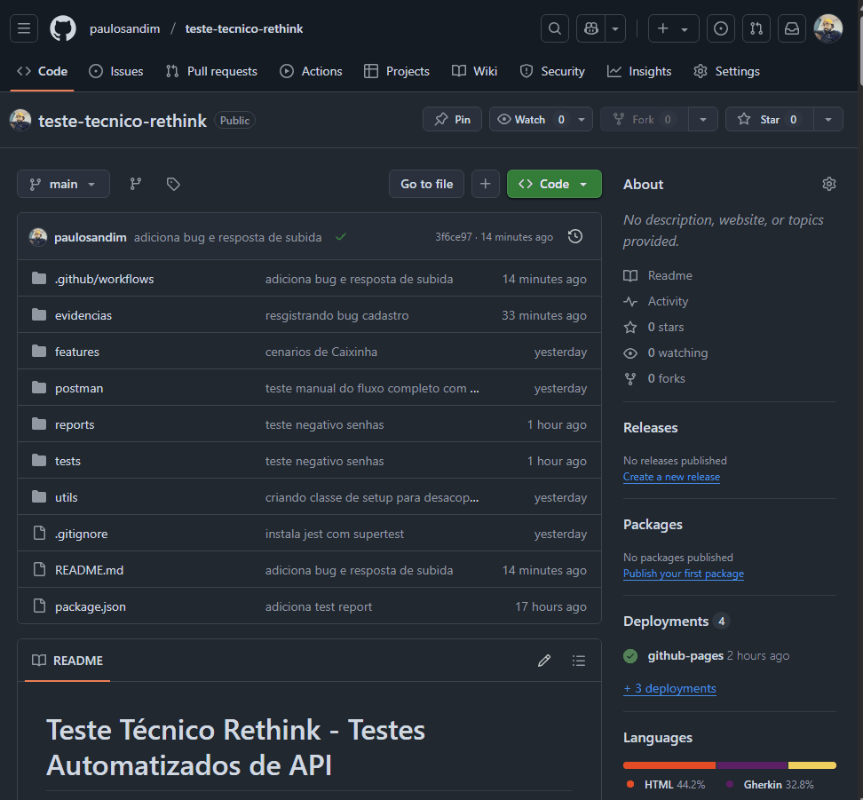
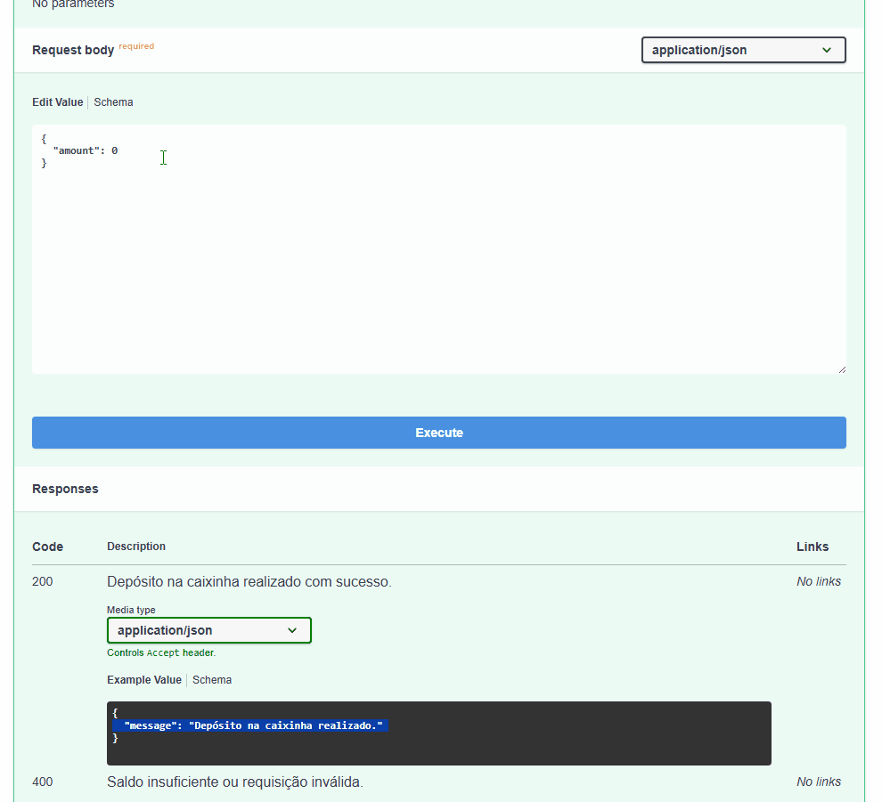
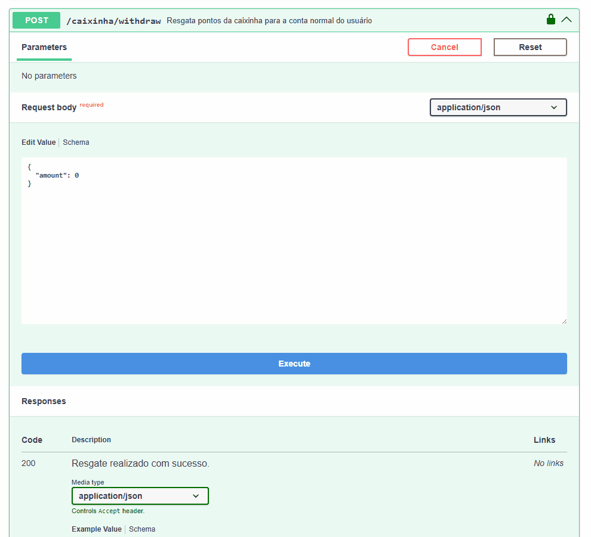
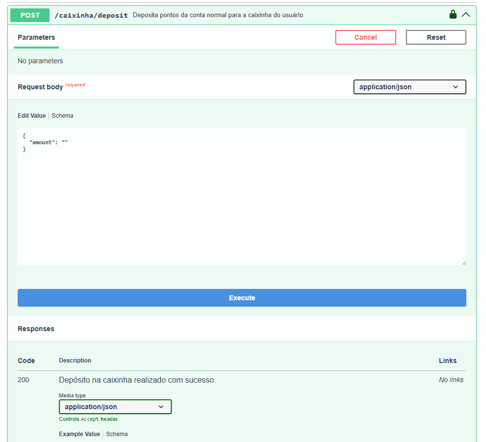
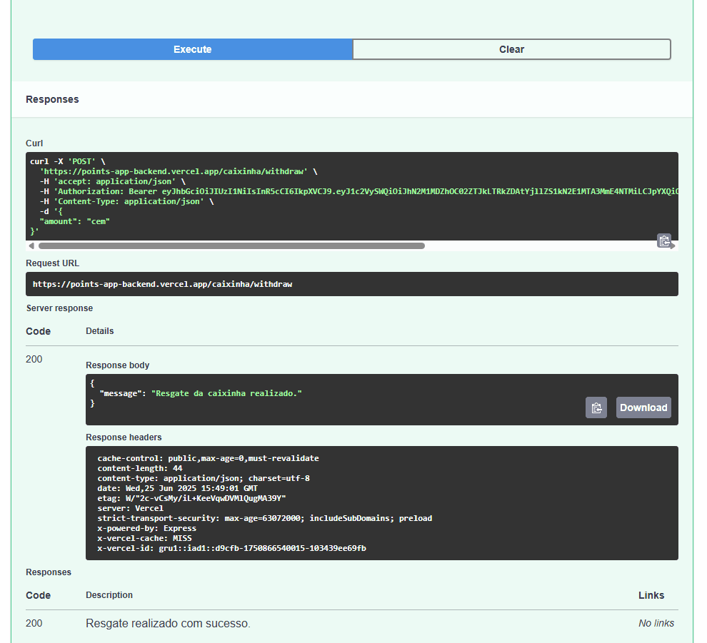
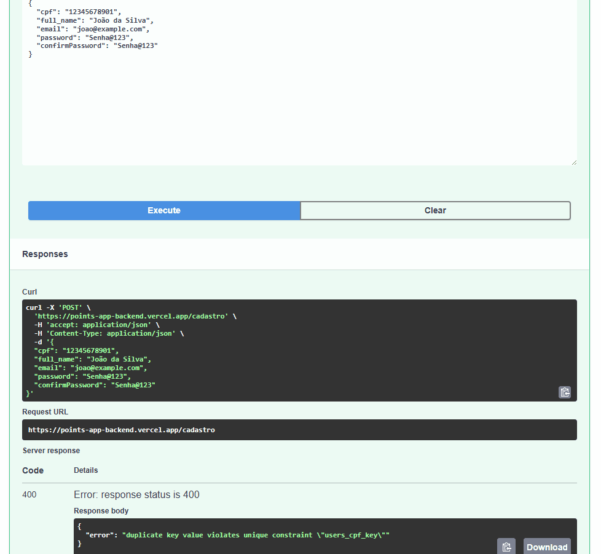

# Teste Técnico Rethink - Testes Automatizados de API

Este projeto contém a automação de testes end-to-end para a API de Bank [Rethink](https://points-app-backend.vercel.app/docs).

É parte de um Teste Técnico para vaga de QA Sênior na empresa **Rethink**.

---

## Funcionalidades Testadas na Automação da API

- Cadastro de um novo usuário
- Cenários negativos de tentativa de Cadastro
- Confirmação do e-mail do usuário a partir de um token
- Autenticação de um usuário
- Envio de pontos para um usuário
- Deposito de pontos da conta normal para a caixinha do usuário
- Verificação do saldo consolidado do usuário
- Exclusão do usuário

## Casos de Testes 

- Os Casos de teste estão na pasta [features](./features), no formato Gherkin e prontos para serem usados com Cucumber.

- Foram divididos seguindo o modelo do Swagger: Auth, Caixinha e Points.

---

## Tecnologias Utilizadas

- [Jest](http://jestjs.io/)
- [SuperTest](https://www.npmjs.com/package/supertest)
- [Faker](https://fakerjs.dev/)
- [Node.js 22+](https://nodejs.org/en/download)
- [Postman](https://www.postman.com/)
- [Jest HTML Reporter](https://www.npmjs.com/package/jest-html-reporter)
- [GitHub Actions](https://github.com/features/actions)

---

## Instalação e execução

### Instalação das dependências:

```
npm install
```

### Execução:

```
npm test
```

---

## Evidências dos Testes

### Execução Completa no Postman:

- A collection e o environment podem ser encontrados na pasta [postman](./postman/) para execução.



### Execução Completa no Jest e Relatório HTML:

- O Relatório pode ser encontrado no formato HTML, para download, na pasta [reports](./reports/) ou como Artefato dentro da execução do Workflow nas Actions.



### Execução via GitHub Actions:

- É possível executar qualquer Workflow do GitHub Actions novamente. É só clicar na opção [Actions](https://github.com/paulosandim/teste-tecnico-rethink/actions), selecionar o Workflow que deseja, clica em *Re-run all jobs* e confirma no *Re-run jobs*.



---

## Bugs

### Bug 01 - Usuário Deletado realizando operações de Cadastro/Criação
### Criticidade: Média

- Após exclusão do usuário, ainda é possível realizar requisições do tipo *POST*, por exemplo, enviar pontos, depositar pontos, etc.
- Mesmo sendo um soft delete, é uma boa prática bloquear operações de cadastro/criação.

**Dados do Usuário:**
```
{
  "cpf": "12345678941",
  "full_name": "João da Silva",
  "email": "joao@mail.com",
  "password": "Senha@123",
  "confirmPassword": "Senha@123"
}
```

**Evidências:**


---

### Bug 02 - Retorno incorreto ao passar valor 0 como amount na rota /caixinha/deposit
### Criticidade: Média

- Quando o usuário faz a requisição */caixinha/deposit* passando o valor 0 no campo *amount*, está sendo retornado *Status Code 200* e a mensagem *"Depósito na caixinha realizado com sucesso."*.
- O correto seria *Status Code 400* e a mensagem *"Saldo insuficiente ou requisição inválida."*, conforme descrito na documentação que está no [Swagger](https://points-app-backend.vercel.app/docs).

**Evidências:**



---

### Bug 03 - Retorno incorreto ao passar valor 0 como amount na rota /caixinha/withdraw
### Criticidade: Média

- Quando o usuário faz a requisição */caixinha/withdraw* passando o valor 0 no campo *amount*, está sendo retornado *Status Code 200* e a mensagem *"Resgate da caixinha realizado."*.
- O correto seria *Status Code 400* e a mensagem *"Saldo na caixinha insuficiente ou requisição inválida."*, conforme descrito na documentação que está no Swagger.

**Evidências:**



---

### Bug 04 - Retorno incorreto ao passar String como amount na rota /caixinha/deposit
### Criticidade: Alta

- Quando o usuário faz a requisição */caixinha/deposit* passando uma string (vazia ou não) no campo *amount*, está sendo retornado *Status Code 200* e a mensagem *"Depósito na caixinha realizado com sucesso."*.
- O correto seria *Status Code 400* e a mensagem *"Saldo insuficiente ou requisição inválida."*, conforme descrito na documentação que está no Swagger.

**Evidências:**



---

### Bug 05 - Retorno incorreto ao passar String como amount na rota /caixinha/withdraw
### Criticidade: Alta

- Quando o usuário faz a requisição */caixinha/withdraw* passando uma string (vazia ou não) no campo *amount*, está sendo retornado *Status Code 200* e a mensagem *"Resgate da caixinha realizado."*.
- O correto seria *Status Code 400* e a mensagem *"Saldo na caixinha insuficiente ou requisição inválida."*, conforme descrito na documentação que está no Swagger.

**Evidências:**



---

### Bug 06 - Mensagem muito genérica para o usuário ao tentar realizar Cadastro
### Criticidade: Baixa

- Caso o usuário erre o CPF, ou e-mail, no momento de realizar o Cadastro, é retornado mensagens genéricas. 
- Ideal seria padronizar esses retornos, seguindo, claro, boas práticas da LGPD.

**Evidências:**


---

### Legenda Criticidade:

- **Alta**: O bug precisa ser corrigido imediatamente, pois representa um risco significativo para o negócio ou para os usuários.

- **Média**: O bug precisa ser corrigido em breve, mas não representa um risco imediato.

- **Baixa**: O bug pode ser corrigido em um momento posterior, sem impacto significativo no negócio ou nos usuários.

---

## O sistema está pronto para subir em Produção?

### Não está pronto. Não recomendaria subida para Produção.

1 - Dado que estamos trabalhando com sistema financeiro, as validações estão frágeis. Por exemplo, no */caixinha/deposit* e no */caixinha/withdraw* estão aceitando o *mount = 0*, além de aceitar Strings. Isso é crítico para qualquer sistema que movimenta pontos/dinheiro. Nesse contexto, podemos ter inconsistências de saldo, bugs sem percebemos e até mesmo tentativas de ações maliciosas.

2 - Usuário deletado que pode interagir com o sistema, o correto seria impedi-lo de realizar as operações normalmente. Por exemplo, ter flags de proteção nesses casos, seguindo a LGPD, evitando incosistências em auditórias, falsos positivos em relatórios, etc.

3 - Nos bugs do *amout*, onde o *status code era 200 ao invés de 400*, gerando um falso positivo, são quebras de contrato da API. Pode parecer inofensivo, porém, quando formos trabalhar com front-end, automações e até mesmo integrações com parceiros, essas quebras de contrato podem ser prejudiciais.
