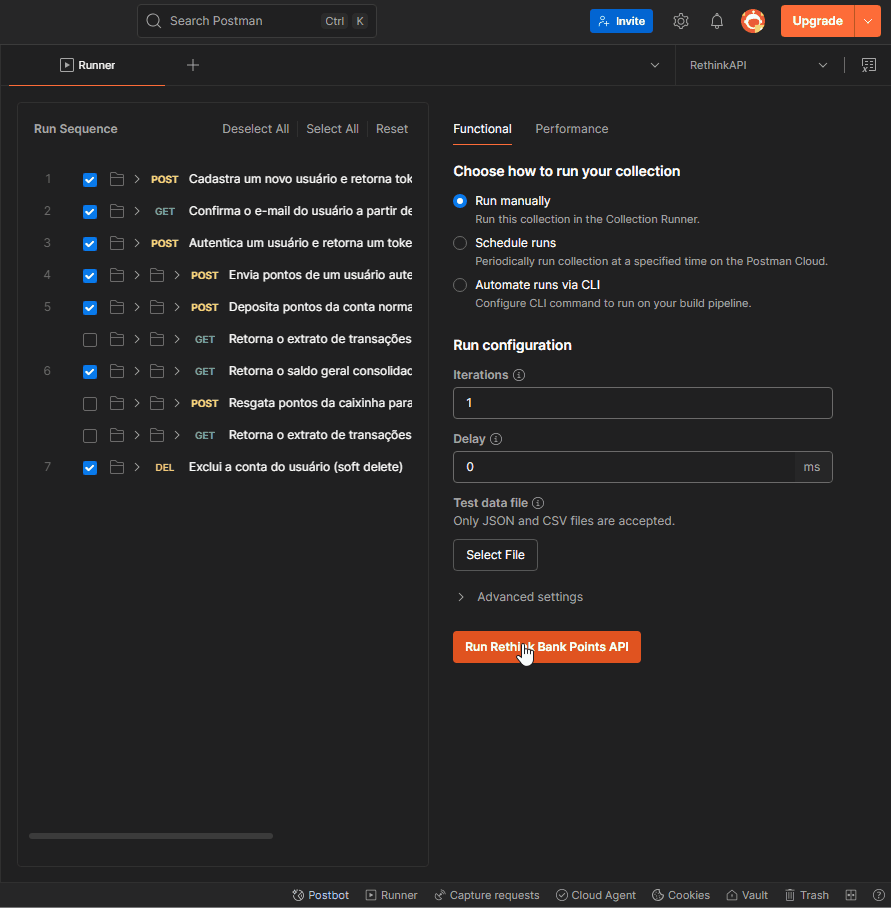
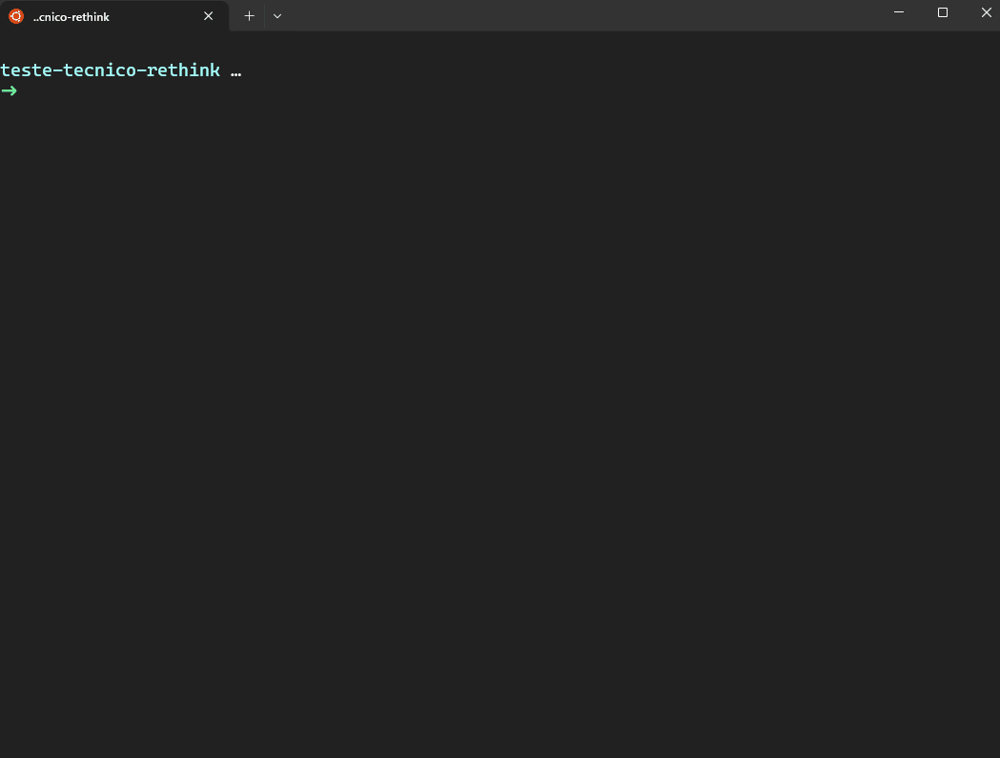

# Teste Técnico Rethink - Testes Automatizados de API

Este projeto contém a automação de testes end-to-end para a API de Bank [Rethink](https://points-app-backend.vercel.app/docs).

É parte de um Teste Técnico para vaga de QA Sênior na empresa **Rethink**.

## Funcionalidades Testadas na Automação da API

- Cadastro de um novo usuário
- Confirmação do e-mail do usuário a partir de um token
- Autenticação de um usuário
- Envio de pontos para um usuário
- Deposito de pontos da conta normal para a caixinha do usuário
- Verificação do saldo consolidado do usuário
- Exclusão do usuário

## Casos de Testes 

- Os Casos de teste estão na pasta [features](./features), no formato Gherkin e prontos para serem usados com Cucumber.

- Foram divididos seguindo o modelo do Swagger: Auth, Caixinha e Points.

## Tecnologias Utilizadas

- [Jest](http://jestjs.io/)
- [SuperTest](https://www.npmjs.com/package/supertest)
- [Faker](https://fakerjs.dev/)
- [Node.js 22+](https://nodejs.org/en/download)
- [Postman](https://www.postman.com/)


## Instalação e execução

### Instalação das dependências:

```
npm install
```

### Execução:

```
npm test
```

## Evidências dos Testes

### Execução Completa no Postman:


### Execução Completa no Jest e Relatório HTML:
- O Relatório pode ser encontrado na pasta [reports](./reports), no formato HTML e pronto para ser visualizado após a cada execução.




## Bugs encontrados:
